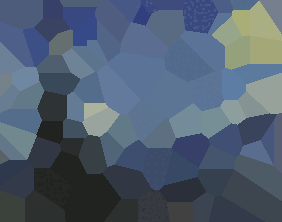

# Evolutionary Image Imitation
This project explores evolutionary algorithm techniques, specifically genetic algorithm techniques, to imitate and recreate images using [Voronoi diagrams](https://mathworld.wolfram.com/VoronoiDiagram.html) with limited number of points.

# Example Evolution


This shows the evolution of the imitation of Van Gogh's *Starry Night* using 100 points over 500 generations with one point crossver, default mutation method, and color optimized according to average RGB values of all Voronoi cells (see [About the Genetic Algorithm](#About%20the%20Genetic%20Algorithm) section for detailed explaination).

# Usage
To run this code, install the required packages from [requirements.txt](requirements.txt) and open the Jupyter notebook [`analysis.ipynb`](./analysis.ipynb) for an example of how to run the code and experiment with it.

```bash
pip install -r requirements.txt
```

To start a Jupyter notebook instance, have [Jupyter notebook installed](https://jupyter.org/install#jupyter-notebook) and start it up in this directory.

# About the Genetic Algorithm

## Gentic Encoding
Each individual in the population consists of a list of integers of length 5*`num_points` 
that can be used to generate the Voronoi diagram. 
Each point used to generate the Voronoi diagram has a definite position and color. 
The point is represented using a string of 5 integers $(x, y, r, g, b)$; 
the $x$ (ranging from 0 to the image’s width-1) and $y$ (ranging from 0 to the image’s height-1) values 
describes the coordinate of the point, 
and the $(r, g, b)$ values (ranging from 0 to 255) describe the color of the region defined by the current point. 

## Initialization
A nubmer of initialization methods has been explored (see [population.py](ga/population.py) for details):
1. "RANDOM": Randomly assign values for coordinates and positions of all points.
2. "PICK_SINGLE_COORD_COLOR": Randomly assign values for coordinates. For each coordinate, assign a color based on the original color found in the reference image at the coordinate.
3. "PICK_AVERAGE_CELL_COLOR": Randomly assign values for coordinates. Then assign a color by calculating the average RGB values of all the pixels within the corresponding Voronoi cell area in the reference image.
4. "PICK_DOMINANT_CELL_COLOR": Randomly assign values for coordinates. Then assign a color based on the dominant color found in the reference image within the cell area.

The initialization method used is defined by the parameter `Evolution.initialization`.

## Fitness Evaluation
The fitness establishes how well an individual imitates the reference painting and is calculated using `image_diff` from [`imgcompare`](https://github.com/datenhahn/imgcompare). image_diff determines the pixel difference between the original image and the produced image using color histograms, and then assigns a score to this difference image. The lower the score, the better.

## Selection
The algorithm currently uses tournament selection only, the tournament size and the selection method is defined by the parameter `Evolution.selection_name`.

## Crossover
One point crossover and two point crossover have been experimented, see [variation.py](ga/variation.py) for details. The crossover method is defined by the parameter `Evolution.crossover_method`.

## Mutation
See [variation.py](ga/variation.py) and [evolution.py](ga/evolution.py) for details.

The "DEFAULT" method randomly mutate values in the individual.

"IMPROVED_REPLACEMENT_AVERAGE_CELL_COLOR" and "IMPROVED_REPLACEMENT_DOMINANT_CELL_COLOR" are greedy approachs that searches for superior alternatives of an individual. This algorithm starts off by converting the encoded genotype into a list of coordinates, excluding the color information. For each coordinate selected for mutation, a set of random candidate coordinates is generated. A candidate individual is created by replacing the original coordinate with the candidate coordinate, then colors are assigned, using either the average color or dominant color selection methods as described in [Initialization](#Initialization) for all coordinates of this candidate individual. Fitness values are calculated for each candidate individual, and the original individual is mutated only if the candidate surpasses its fitness value. This strategy aims to explore coordinates that better represent the shape of the reference image.

## Metaheuristics
Color optimization has been experimented using similar methods mentioned in the [Initialization](#Initialization) section. It is defined by `Evolution.optimize_color` and `Evolution.optimize_color_method` and is performed before the start of the next generation on all individuals if `Evolution.optimize_color=True`. The idea is to optimise the colour representation as much as possible, effectively reducing the problem into finding the best set of coordinates that accurately represents the shape of the reference image using a Voronoi diagram.
